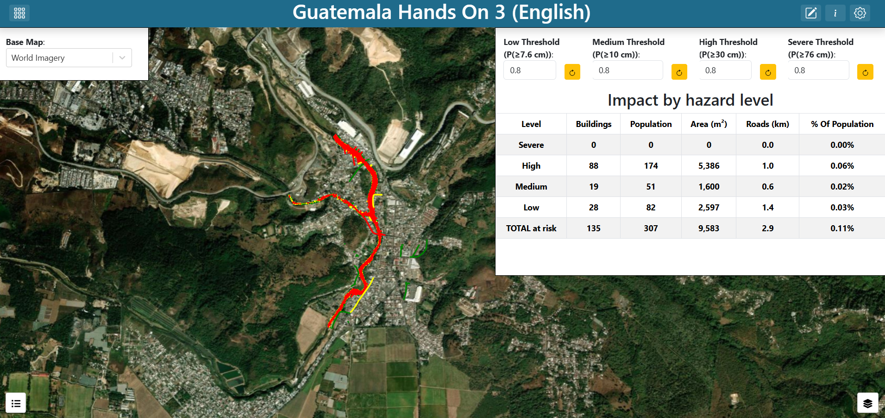
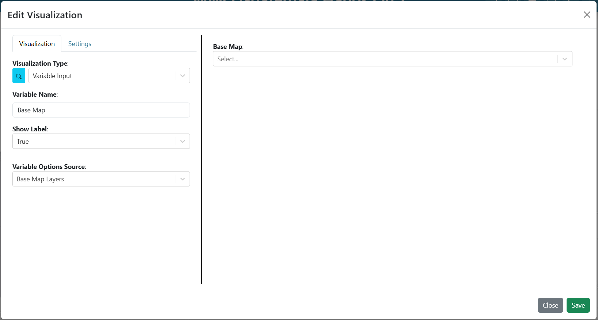
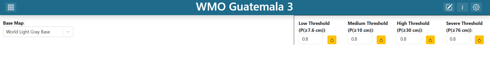
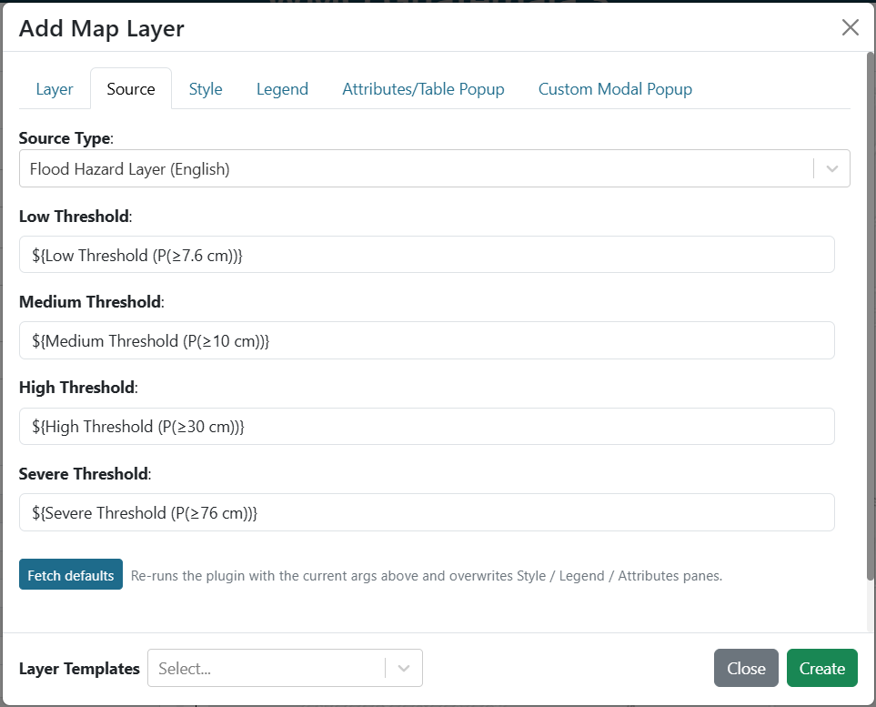

.. Guatemala hands-on exercise 3 solution, English. A Spanish translation lives
.. alongside this file as exercise_3_es.rst.

==============================================================
Exercise 3 — Hazard classification with adjustable thresholds
==============================================================

Building **Guatemala Hands On 3 (English)** step by step.

**Start here** — This exercise reuses the five raster layers from
`Exercise 1 <exercise_1_en.rst>`_, so building that one first will save you time.

.. contents:: On this page
   :depth: 2
   :local:
   :backlinks: none

What you are building
=====================

A full-window map carrying the five rasters from exercise 1 plus two computed
layers: a hazard classification and the buildings and roads that fall inside it.
Four number inputs across the top set the probability threshold for each hazard
level, and an impact table sits under them. Change a threshold and the
classification, the affected features and the table all recompute.

   **Screenshot:** the finished dashboard — full-window map, four threshold
   inputs along the top, impact table on the right.

**Tip** — ``notebooks/03_hazard_classification.ipynb`` derives this
classification as plain Python, including the gate sweep that shows what each
threshold controls. Worth running first if you want to understand the analysis
before assembling the interface.

Understanding the four thresholds
=================================

Each hazard level is tied to **one** depth threshold and has its **own**
probability gate:

.. list-table::
   :header-rows: 1
   :widths: 18 32 25 25

   * - Level
     - Driven by
     - Colour
     - Notebook default gate
   * - Low
     - P(≥ 7.6 cm)
     - green
     - 0.8
   * - Medium
     - P(≥ 10 cm)
     - yellow
     - 0.8
   * - High
     - P(≥ 30 cm)
     - red
     - 0.8
   * - Severe
     - P(≥ 76 cm)
     - purple
     - 0.8

A cell takes the level of the **deepest** threshold whose gate it clears.

**Warning** — Two things to know before you present this, both covered at length
in ``notebooks/03_hazard_classification.ipynb``:

**The 76 cm raster contains only the values 0 and 0.2.** At most 20% of the
ensemble members ever reached that depth anywhere in the domain. So any Severe
gate above 0.2 makes the Severe class *unreachable* — the colour simply never
appears, and a viewer moving that slider gets no feedback distinguishing
"nothing qualifies" from "the control is broken".

Step 1 — Create the dashboard
=============================

#. Create a new dashboard (see
   `Creating a dashboard <getting_started_en.rst#creating-a-dashboard>`_) with:

   * **Name**: ``Guatemala Hands On 3 (English)``
   * **Description**: ``Solution for WMO Guatemala Hands On Exercise #3``

#. Find your dashboard on the landing page and double-click it to open. The
   dashboard is empty, so the preview shows a blank canvas.

#. Open **Dashboard Settings** in the top-right corner, and turn on
   **Unrestricted Grid Item Movement**. Save the settings.

#. Exit **Dashboard Settings** and click **Edit Dashboard** in the top-right
   corner to enter edit mode.

Step 2 — Add the base map selector
==================================

The base map is a variable input so the viewer can switch it without editing
anything. Build the input first, then point the map at it.

#. You will see an existing item on the dashboard. Click on the item's 3-dot
   menu and select **Edit**.

#. Set the **Visualization Type** to **Variable Input** (in the **Default**
   group).

#. Fill in:

   .. list-table::
      :header-rows: 1
      :widths: 32 68

      * - Argument
        - Value
      * - ``variable_name``
        - ``Base Map``
      * - ``show_label``
        - ``True``
      * - ``variable_options_source``
        - ``Base Map Layers``

   ``Base Map Layers`` is a built-in options source — it fills the dropdown with
   the base maps the instance offers, so you do not enumerate them yourself.

#. On the **Settings** tab, set **Background Color** to ``#ffffff``. Without it
   the dropdown floats on the map with no backing and is hard to read.

#. Select an initial value for the dropdown from the preview on the right side
   of the editor. The shipped solution uses ``World Light Gray Base``, but any
   base map is fine.

#. Save the item by clicking **Save** in the bottom-right corner of the item
   editor.

#. Drag the item to the top-left corner over the map and resize it as needed.

#. Save the dashboard by clicking **Save Changes** in the top-right corner of
   the dashboard editor.

   You now have a base map selector on the dashboard, but it does not yet
   control the map.

   **Screenshot:** the **Variable Input** arguments for the base map selector.

Step 3 — Add the four threshold inputs
======================================

Build all four before the layers that consume them. Each is a **Variable Input**
with ``variable_options_source`` set to ``number``:

.. list-table::
   :header-rows: 1
   :widths: 100

   * - ``Variable Name``
   * - ``Low Threshold (P(≥7.6 cm))``
   * - ``Medium Threshold (P(≥10 cm))``
   * - ``High Threshold (P(≥30 cm))``
   * - ``Severe Threshold (P(≥76 cm))``

For **each** of the four:

#. Set the dashboard in edit mode by clicking on the **Edit Dashboard** button
   in the top-right corner.

#. Add another item by clicking **Add Dashboard Item** in the top-right corner.

#. Click on the 3-dot menu of the new item and select **Edit**.

#. Set the **Visualization Type** to **Variable Input** (in the **Default**
   group).

#. Fill in:

   .. list-table::
      :header-rows: 1
      :widths: 32 68

      * - Argument
        - Value
      * - ``variable_name``
        - *see the table above*
      * - ``show_label``
        - ``True``
      * - ``variable_options_source``
        - ``number``

#. On the **Settings** tab, set **Background Color** to ``#ffffff`` 

#. On the **Settings** tab, add a top border by clicking the top border icon. A popup will appear. Change the style to ``solid`` to show the border. 

   Give the leftmost input (``Low Threshold``) a left border and the rightmost (``Severe Threshold``) a right
   border as well, so the four read as one strip.

#. Set the initial value to ``0.8`` in the preview on the right side of the
   editor.

#. Save the item by clicking **Save** in the bottom-right corner of the item
   editor.

#. Drag the item into place along the top of the dashboard, to the right of the
   base map selector, and resize it as needed.

#. Save the dashboard by clicking **Save Changes** in the top-right corner of
   the dashboard editor.

   **Screenshot:** the four threshold inputs side by side, each showing its
   label and value.

Step 4 — Add the map and the five rasters
=========================================
If you have exercise 1 then do the following. If you do not have exercise 1, 
build the map and the five rasters from scratch as in `Exercise 1 <exercise_1_en.rst>`_.: 

#. Open the dashboard from exercise 1

#. Click on the map item's 3-dot menu, choose **Export**, 

#. Open the new dashbord for this exercise.

#. Click **Edit Dashboard** in the top-right corner to enter edit mode.

#. Click the **Import Dashboard Item** in the top-right corner and import the
   dashboard item from exercise 1. 

#. If the map is covering the storm selector and base map selector, click on 
   the 3-dot menu, hove over **Order**, and select **Send to Back**. The 
   selectors should now be visible on top of the map.

#. Save the dashboard by clicking **Save Changes** in the top-right corner of
   the dashboard editor.

Step 5 — Add the hazard classification layer
============================================

#. Set the dashboard in edit mode by clicking on the **Edit Dashboard** button
   in the top-right corner.

#. Click on the map item's 3-dot menu and select **Edit**. You may need to move
   one of the threshold inputs out of the way to see the map menu.

#. Next to **Layers**, click **Add Layer**.

#. Go straight to the **Source** tab and set **Source Type** to **Flood Hazard
   Layer (English)**.

#. The plugin's arguments appear. Fill in:

   .. list-table::
      :header-rows: 1
      :widths: 26 74

      * - Argument
        - Value
      * - ``Low Threshold``
        - ``${Low Threshold (P(≥7.6 cm))}``
      * - ``Medium Threshold``
        - ``${Medium Threshold (P(≥10 cm))}``
      * - ``High Threshold``
        - ``${High Threshold (P(≥30 cm))}``
      * - ``Severe Threshold``
        - ``${Severe Threshold (P(≥76 cm))}``

#. Click **Fetch plugin defaults**. The layer is named **Hazard
   classification**, styled with four rules on the ``peligro`` attribute, and
   given a four-item **Hazard** legend.

#. Save the layer by clicking **Create** at the bottom of the layer editor.

   **Screenshot:** the **Source** tab for the hazard layer, four arguments bound
   to the four threshold variables.

Step 6 — Add the affected-features layer
========================================

#. Next to **Layers**, click **Add Layer** again.

#. Go straight to the **Source** tab and set **Source Type** to **Flood Impact
   Layer (English)**.

#. Bind the same four arguments to the same four variables as in the previous
   step.

#. Click **Fetch plugin defaults**. The layer arrives as **Buildings and roads
   at risk** with eight rules (polygon and linestring per level) and a **Hazard**
   legend.

#. Save the layer by clicking **Create** at the bottom of the layer editor.

The two layers answer different questions from the same thresholds: the hazard
layer classifies *ground*, this one classifies *assets*. Keeping them separate
lets a viewer turn off the ground shading and look only at what is affected.

Step 7 — Finish the map
=======================

#. In the **Map Extent** argument, choose **Use a Custom Extent** and enter:

   .. code-block:: text

      -10077781.20,1629865.34,15.13

#. On the **Settings** tab, turn on **Fill Viewport** so the map occupies the
   whole window.

#. Save the item by clicking **Save** in the bottom-right corner of the map
   editor.

#. Resize the map item to fill the window by dragging the handle in its
   bottom-right corner.

#. Save the dashboard by clicking **Save Changes** in the top-right corner of
   the dashboard editor.

**Important** — The rasters must be the ``PBI_Actividad_2`` EPSG:3857 copies. If
any layer points at a ``Guatemala_IBF`` UTM original, the map will auto-fit to
that raster's projection, jump somewhere far from Guatemala, and the vector
layers will appear to load and then vanish. This exact bug cost real debugging
time on this dashboard.

Step 8 — Add the impact summary table
=====================================

#. Set the dashboard in edit mode by clicking on the **Edit Dashboard** button
   in the top-right corner.

#. Add another item by clicking **Add Dashboard Item** in the top-right corner.

#. Click on the 3-dot menu of the new item and select **Edit**.

#. Set the **Visualization Type** to **Flood Impact Summary (English)** (in the
   **Flood Maps (English)** group).

#. Bind the same four arguments to the same four variables as in step 5.

#. On the **Settings** tab, set **Background Color** to ``#ffffff`` and add
   borders on the left, right and bottom, so it joins the strip of threshold
   inputs above it.

#. Save the item by clicking **Save** in the bottom-right corner of the item
   editor.

#. Drag the item directly below the threshold inputs on the right and resize it
   as needed.

#. Save the dashboard by clicking **Save Changes** in the top-right corner of
   the dashboard editor.

Step 9 — Test the wiring
========================

Leave edit mode and move a threshold. The hazard shading, the affected features
and the table should all recompute together, with progress messages while the
layers rebuild.

.. figure:: images/ex3-thresholds-in-action.png
   :alt: The dashboard before and after lowering a threshold
   :width: 100%

   **Screenshot:** the same view before and after lowering the High threshold,
   showing the classification expand.

Checkpoint
==========

You should now have:

* A map filling the window, with eight layers in the layer control (including
  the base map).
* Four labelled threshold inputs across the top, each stepping by 0.05.
* Moving any threshold updates the hazard layer, the impact layer and the table.
* Raising the Severe threshold above 0.2 makes purple disappear entirely — and
  it should, for the reason in the warning above.
* Progress messages while the layers recompute.

Talking points
==============

* **Four gates on four different questions.** "Severe" means P(≥76 cm) ≥ 0.15
  while "High" means P(≥30 cm) ≥ 0.1. Those are different questions with
  different cutoffs, so the level names are not comparable to each other and
  "severe" carries no meaning on its own. Setting all four gates equal is a good
  demonstration: the levels then differ only by depth, which is far easier to
  explain.
* **An unreachable class is an interface problem.** The Severe gate can be set
  where nothing can qualify, and the interface gives no hint. Ask attendees how
  they would fix it — cap the input at 0.2? show the value range? annotate the
  legend? There is no single right answer, and the discussion is the point.
* **Vectorising a classification.** A map layer can only point at a URL, and
  nothing here serves a computed raster, so the plugin vectorises the classified
  grid into roughly 600 polygons. Adjacent cells of equal class merge, so this is
  exact rather than an approximation. Normal and NoData are dropped — about 90%
  of the grid — because a basemap shows unaffected ground better than a coloured
  layer does.
* **Where the probabilities came from.** These arrived already populated in the
  partners' geopackage with no note on method. Notebook 3 recovers it by testing
  four candidate samplings and lands on ``all_touched`` zonal maximum at about
  98% agreement, with the residual pointing at a real open question about the
  data. Worth raising as a lesson in verifying rather than assuming.

Item positions
==============

The grid is 100 columns wide. Positions are ``x``, ``y`` (top-left) and ``w``,
``h`` (size in grid units). Match approximately; these are for reference, not
transcription.

.. list-table::
   :header-rows: 1
   :widths: 46 14 14 13 13

   * - Item
     - x
     - y
     - w
     - h
   * - Map (**Fill Viewport**)
     - 0
     - 0
     - 99
     - 41
   * - Variable Input — Base Map
     - 0
     - 0
     - 17
     - 6
   * - Variable Input — Low Threshold
     - 56
     - 0
     - 11
     - 7
   * - Variable Input — Medium Threshold
     - 66
     - 0
     - 13
     - 7
   * - Variable Input — High Threshold
     - 78
     - 0
     - 11
     - 7
   * - Variable Input — Severe Threshold
     - 88
     - 0
     - 12
     - 7
   * - Flood Impact Summary (table)
     - 56
     - 7
     - 44
     - 21

Notes on the shipped JSON
=========================

Two small discrepancies you may notice when comparing this guide against
``dashboards/Guatemala_Hands_On_3_English.json``. Neither affects behaviour;
both are recorded so they do not read as mistakes in your own work.

* **The 30 cm probability layer has** ``rampMin`` **of** ``"00"`` **rather than**
  ``"0"``. A typing artifact from the GUI. It parses to zero identically.
* **The threshold inputs store two different defaults.** The active value,
  ``initial_value``, is ``0.8`` on all four. The options metadata also carries an
  ``initialValue`` of 0.3 / 0.2 / 0.1 / 0.15 — the notebook defaults — left over
  from an earlier revision. The dashboard loads at 0.8. If you want the
  notebook's classification on first load, set the initial value to the gates in
  `Understanding the four thresholds`_ instead.
