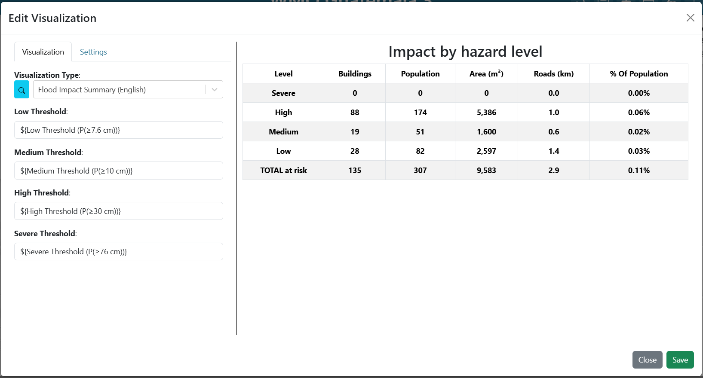
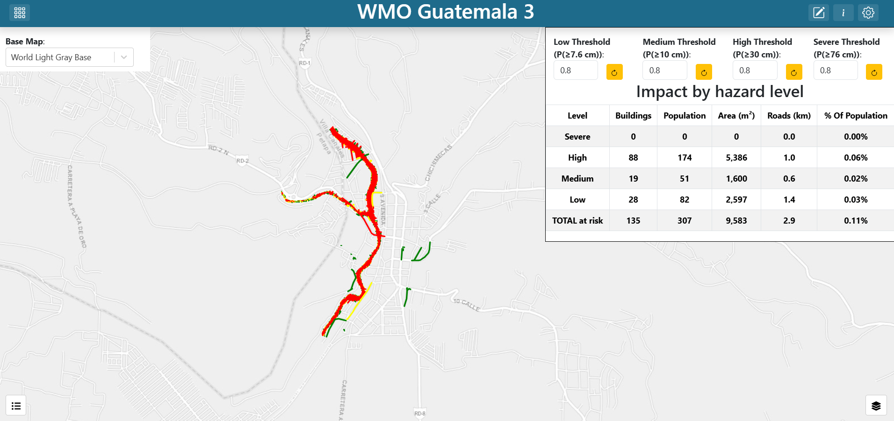
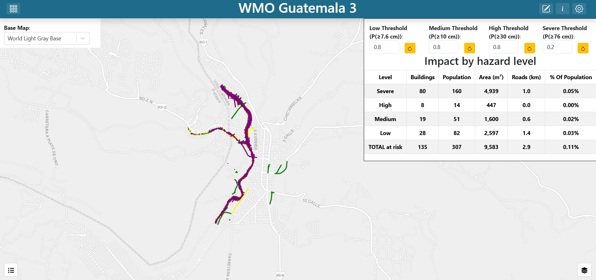

.. Solución del ejercicio práctico 3 de Guatemala, español. La versión en inglés
.. está junto a este archivo como exercise_3_en.rst.

==============================================================
Ejercicio 3 — Clasificación de peligro con umbrales ajustables
==============================================================

Construcción de **Guatemala Práctica 3 (Español)**, paso a paso.

Recuerde que la interfaz está en inglés, así que los nombres de botones y
campos se dejan en inglés y en negrita.

.. contents:: En esta página
   :depth: 2
   :local:
   :backlinks: none

Qué va a construir
==================

Un mapa a pantalla completa con los cinco rásteres del ejercicio 1 más dos capas
calculadas: una clasificación de peligro y los edificios y carreteras que caen
dentro de ella. Cuatro campos numéricos en la parte superior definen el umbral de
probabilidad de cada nivel de peligro, y debajo de ellos hay una tabla de impacto.
Al cambiar un umbral, la clasificación, los elementos afectados y la tabla se
vuelven a calcular.

.. figure:: images/ex3-finished.png
   :alt: El tablero terminado del ejercicio 3
   :width: 100%

   **Captura:** el tablero terminado: mapa a pantalla completa, cuatro campos de
   umbral en la parte superior y la tabla de impacto a la derecha.

**Consejo** — ``notebooks/03_hazard_classification_es.ipynb`` deriva esta
clasificación en Python, incluido el barrido de umbrales que muestra qué controla
cada uno. Vale la pena ejecutarlo primero si quiere entender el análisis antes de
armar la interfaz.

Entender los cuatro umbrales
============================

Cada nivel de peligro está ligado a **una** profundidad y tiene su **propio**
umbral de probabilidad:

.. list-table::
   :header-rows: 1
   :widths: 18 32 25 25

   * - Nivel
     - Determinado por
     - Color
     - Umbral inicial
   * - Bajo
     - P(≥ 7.6 cm)
     - verde
     - 0.8
   * - Medio
     - P(≥ 10 cm)
     - amarillo
     - 0.8
   * - Alto
     - P(≥ 30 cm)
     - rojo
     - 0.8
   * - Severo
     - P(≥ 76 cm)
     - morado
     - 0.8

Una celda toma el nivel del umbral **más profundo** que logra superar.

**Advertencia** — Dos cosas que conviene saber antes de presentar esto, ambas
tratadas en detalle en ``notebooks/03_hazard_classification_es.ipynb``:

**El ráster de 76 cm solo contiene los valores 0 y 0.2.** A lo sumo el 20% de los
miembros del conjunto alcanzó esa profundidad en algún punto del dominio. Por eso,
cualquier umbral Severo por encima de 0.2 vuelve *inalcanzable* la clase Severo: el
color simplemente nunca aparece, y quien mueva ese control no recibe ninguna señal
que distinga entre "nada califica" y "el control está roto".

Paso 1 — Crear el tablero
=========================

#. Cree un tablero nuevo (vea
   `Crear un tablero <getting_started_es.rst#crear-un-tablero>`_) con:

   * **Name**: ``Guatemala Práctica 3 (Español)``
   * **Description**: ``Solución para el Ejercicio Práctico #3 de la OMM en Guatemala``

#. Busque su tablero en la página de inicio y haga doble clic para abrirlo. El
   tablero está vacío, así que la previsualización muestra un lienzo en blanco.

#. Abra **Dashboard Settings** en la esquina superior derecha y active
   **Unrestricted Grid Item Movement**. Guarde la configuración.

#. Salga de **Dashboard Settings** y haga clic en **Edit Dashboard**, en la
   esquina superior derecha, para entrar en modo de edición.

Paso 2 — Agregar el selector de mapa base
=========================================

El mapa base es una variable de entrada, para que el usuario pueda cambiarlo sin
editar nada. Construya primero la variable y después apunte el mapa a ella.

#. Verá un elemento que ya existe en el tablero. Haga clic en el menú de 3 puntos
   del elemento y seleccione **Edit**.

#. Ponga **Visualization Type** en **Variable Input** (en el grupo **Default**).

#. Complete:

   .. list-table::
      :header-rows: 1
      :widths: 32 68

      * - Argumento
        - Valor
      * - ``variable_name``
        - ``Mapa Base``
      * - ``show_label``
        - ``True``
      * - ``variable_options_source``
        - ``Base Map Layers``

   ``Base Map Layers`` es una fuente de opciones incorporada: llena el desplegable
   con los mapas base que ofrece la instancia, así que no hace falta enumerarlos.

#. En la pestaña **Settings**, ponga **Background Color** en ``#ffffff``. Sin eso,
   el desplegable flota sobre el mapa sin fondo y es difícil de leer.

#. Elija un valor inicial para el desplegable desde la previsualización, en el lado
   derecho del editor. La solución entregada usa ``World Light Gray Base``, pero
   cualquier mapa base sirve.

#. Guarde el elemento haciendo clic en **Save**, en la esquina inferior derecha del
   editor del elemento.

#. Arrastre el elemento a la esquina superior izquierda, sobre el mapa, y cambie su
   tamaño según haga falta.

#. Guarde el tablero haciendo clic en **Save Changes**, en la esquina superior
   derecha del editor del tablero.

   Ya tiene un selector de mapa base en el tablero, pero todavía no controla el
   mapa.

.. figure:: images/ex1-variable-input-basemap.png
   :alt: La configuración de la variable de entrada del mapa base
   :width: 100%

   **Captura:** los argumentos de **Variable Input** del selector de mapa base.

Paso 3 — Agregar los cuatro campos de umbral
============================================

Construya los cuatro antes que las capas que los consumen. Cada uno es un
**Variable Input** con ``variable_options_source`` en ``number``:

.. list-table::
   :header-rows: 1
   :widths: 100

   * - ``Variable Name``
   * - ``Umbral Bajo (P(≥7.6 cm))``
   * - ``Umbral Medio (P(≥10 cm))``
   * - ``Umbral Alto (P(≥30 cm))``
   * - ``Umbral Severo (P(≥76 cm))``

Para **cada** uno de los cuatro:

#. Ponga el tablero en modo de edición haciendo clic en el botón
   **Edit Dashboard**, en la esquina superior derecha.

#. Agregue otro elemento haciendo clic en **Add Dashboard Item**, en la esquina
   superior derecha.

#. Haga clic en el menú de 3 puntos del elemento nuevo y seleccione **Edit**.

#. Ponga **Visualization Type** en **Variable Input** (en el grupo **Default**).

#. Complete:

   .. list-table::
      :header-rows: 1
      :widths: 32 68

      * - Argumento
        - Valor
      * - ``variable_name``
        - *vea la tabla anterior*
      * - ``show_label``
        - ``True``
      * - ``variable_options_source``
        - ``number``

#. En la pestaña **Settings**, ponga **Background Color** en ``#ffffff``.

#. En la pestaña **Settings**, agregue un borde superior haciendo clic en el icono
   del borde superior. Aparecerá una ventana emergente. Cambie el estilo a
   ``solid`` para que el borde se muestre.

   Dele además un borde izquierdo al campo de más a la izquierda
   (``Umbral Bajo``) y un borde derecho al de más a la derecha
   (``Umbral Severo``), para que los cuatro se lean como una sola franja.

#. Ponga el valor inicial en ``0.8`` desde la previsualización, en el lado derecho
   del editor.

#. Guarde el elemento haciendo clic en **Save**, en la esquina inferior derecha del
   editor del elemento.

#. Arrastre el elemento a su lugar, a lo largo de la parte superior del tablero y a
   la derecha del selector de mapa base, y cambie su tamaño según haga falta.

#. Guarde el tablero haciendo clic en **Save Changes**, en la esquina superior
   derecha del editor del tablero.

.. figure:: images/ex3-threshold-inputs.png
   :alt: Los cuatro campos de umbral a lo largo de la parte superior del tablero
   :width: 100%

   **Captura:** los cuatro campos de umbral uno al lado del otro, cada uno con su
   etiqueta y su valor.

Paso 4 — Agregar el mapa y los cinco rásteres
=============================================

Si tiene el ejercicio 1, siga los pasos de abajo. Si no lo tiene, construya el mapa
y los cinco rásteres desde cero como en el
`Ejercicio 1 <exercise_1_es.rst>`_.

#. Abra el tablero del ejercicio 1.

#. Haga clic en el menú de 3 puntos del elemento del mapa y elija **Export**.

#. Abra el tablero nuevo de este ejercicio.

#. Haga clic en **Edit Dashboard**, en la esquina superior derecha, para entrar en
   modo de edición.

#. Haga clic en **Import Dashboard Item**, en la esquina superior derecha, e
   importe el elemento del ejercicio 1.

#. Si el mapa está cubriendo los selectores, haga clic en el menú de 3 puntos, pase
   el cursor sobre **Order** y seleccione **Send to Back**. Los selectores deberían
   quedar visibles sobre el mapa.

#. Edite el elemento del mapa. Para cada uno de los cinco rásteres, edite la capa y
   desactive **Default Visibility** en la pestaña **Layer**. Así las capas quedarán
   ocultas cuando el tablero se cargue por primera vez. Asegúrese de guardar la
   capa después de editarla.

#. Guarde el tablero haciendo clic en **Save Changes**, en la esquina superior
   derecha del editor del tablero.

Paso 5 — Agregar la capa de clasificación de peligro
====================================================

#. Ponga el tablero en modo de edición haciendo clic en el botón
   **Edit Dashboard**, en la esquina superior derecha.

#. Haga clic en el menú de 3 puntos del elemento del mapa y seleccione **Edit**.
   Puede que tenga que mover uno de los campos de umbral para poder ver el menú del
   mapa.

#. Junto a **Layers**, haga clic en **Add Layer**.

#. Vaya directamente a la pestaña **Source** y ponga **Source Type** en
   **Capa de Peligro (Español)**.

#. Aparecen los argumentos del módulo. Complete:

   .. list-table::
      :header-rows: 1
      :widths: 26 74

      * - Argumento
        - Valor
      * - ``Umbral Bajo``
        - ``${Umbral Bajo (P(≥7.6 cm))}``
      * - ``Umbral Medio``
        - ``${Umbral Medio (P(≥10 cm))}``
      * - ``Umbral Alto``
        - ``${Umbral Alto (P(≥30 cm))}``
      * - ``Umbral Severo``
        - ``${Umbral Severo (P(≥76 cm))}``

#. Haga clic en **Fetch plugin defaults**. La capa recibe el nombre
   **Clasificación de peligro**, un estilo con cuatro reglas sobre el atributo
   ``peligro`` y una leyenda **Peligro** de cuatro entradas.

#. Guarde la capa haciendo clic en **Create**, al pie del editor de capas.

.. figure:: images/ex3-hazard-layer-source.png
   :alt: La configuración de la fuente de la capa de peligro con los cuatro umbrales vinculados
   :width: 100%

   **Captura:** la pestaña **Source** de la capa de peligro, con los cuatro
   argumentos vinculados a las cuatro variables de umbral.

Paso 6 — Agregar la capa de elementos afectados
===============================================

#. Junto a **Layers**, haga clic otra vez en **Add Layer**.

#. Vaya directamente a la pestaña **Source** y ponga **Source Type** en
   **Capa de Impacto (Español)**.

#. Vincule los mismos cuatro argumentos a las mismas cuatro variables que en el
   paso anterior.

#. Haga clic en **Fetch plugin defaults**. La capa llega con el nombre
   **Edificios y carreteras en peligro**, ocho reglas (polígono y línea por cada
   nivel) y una leyenda **Peligro**.

#. Guarde la capa haciendo clic en **Create**, al pie del editor de capas.

Las dos capas responden preguntas distintas a partir de los mismos umbrales: la
capa de peligro clasifica el *terreno* y esta clasifica los *bienes*. Mantenerlas
separadas permite que el usuario apague el sombreado del terreno y mire solo lo que
está afectado.

Paso 7 — Terminar el mapa
=========================

#. En el argumento **Map Extent**, elija **Use a Custom Extent** e ingrese:

   .. code-block:: text

      -10077781.20,1629865.34,15.13

#. En la pestaña **Settings**, active **Fill Viewport** para que el mapa ocupe
   toda la ventana.

#. Guarde el elemento haciendo clic en **Save**, en la esquina inferior derecha del
   editor del mapa.

#. Cambie el tamaño del elemento del mapa para que ocupe toda la ventana,
   arrastrando el controlador de su esquina inferior derecha.

#. Asegúrese de devolver el campo de umbral a su lugar.

#. Guarde el tablero haciendo clic en **Save Changes**, en la esquina superior
   derecha del editor del tablero.

**Importante** — Los rásteres deben ser las copias en EPSG:3857 de
``PBI_Actividad_2``. Si alguna capa apunta a un original en UTM de
``Guatemala_IBF``, el mapa se ajustará automáticamente a la proyección de ese
ráster, saltará a un lugar lejano de Guatemala y las capas vectoriales parecerán
cargar y luego desaparecerán. Este error exacto costó tiempo real de depuración en
este tablero.

Paso 8 — Agregar la tabla de resumen de impacto
===============================================

#. Ponga el tablero en modo de edición haciendo clic en el botón
   **Edit Dashboard**, en la esquina superior derecha.

#. Agregue otro elemento haciendo clic en **Add Dashboard Item**, en la esquina
   superior derecha.

#. Haga clic en el menú de 3 puntos del elemento nuevo y seleccione **Edit**.

#. Ponga **Visualization Type** en **Resumen de Impacto (Español)** (en el grupo
   **Mapas de Inundación (Español)**).

#. Vincule los mismos cuatro argumentos a las mismas cuatro variables que en el
   paso 5.

#. En la pestaña **Settings**, ponga **Background Color** en ``#ffffff`` y agregue
   bordes a la izquierda, a la derecha y abajo, para que se una a la franja de
   campos de umbral que está arriba.

#. Guarde el elemento haciendo clic en **Save**, en la esquina inferior derecha del
   editor del elemento.

#. Arrastre el elemento justo debajo de los campos de umbral, a la derecha, y
   cambie su tamaño según haga falta.

#. Guarde el tablero haciendo clic en **Save Changes**, en la esquina superior
   derecha del editor del tablero.

   **Captura:** los argumentos de la tabla de resumen de impacto vinculados a las
   cuatro variables de umbral.

Paso 9 — Probar las conexiones
==============================

Cambie un umbral. El sombreado de peligro, los elementos afectados y la tabla
deberían recalcularse juntos, con mensajes de progreso mientras las capas se
reconstruyen. Como demostración, baje el umbral Severo a 0.2. La clase Severo, en
morado, se expande hasta cubrir la mayor parte del cauce, y la tabla muestra más
edificios y carreteras afectados.

   **Captura:** la misma vista antes de bajar el umbral Severo.

   **Captura:** la misma vista después de bajar el umbral Severo.

Punto de control
================

A estas alturas debería tener:

* Un mapa que ocupa la ventana, con ocho capas en el control de capas (incluido el
  mapa base).
* Cuatro campos de umbral etiquetados en la parte superior, cada uno con paso de
  0.05.
* Al mover cualquier umbral se actualizan la capa de peligro, la capa de impacto y
  la tabla.
* Subir el umbral Severo por encima de 0.2 hace que el morado desaparezca por
  completo, y así debe ser, por la razón que explica la advertencia de arriba.
* Mensajes de progreso mientras las capas se recalculan.

Puntos de discusión
===================

* **Cuatro umbrales sobre cuatro preguntas distintas.** "Severo" significa
  P(≥76 cm) ≥ 0.15, mientras que "Alto" significa P(≥30 cm) ≥ 0.1. Son preguntas
  diferentes con cortes diferentes, así que los nombres de los niveles no son
  comparables entre sí y "severo" no significa nada por sí solo. Poner los cuatro
  umbrales en el mismo valor es una buena demostración: los niveles se diferencian
  entonces solo por la profundidad, que es mucho más fácil de explicar.
* **Una clase inalcanzable es un problema de interfaz.** El umbral Severo se puede
  poner donde nada puede calificar, y la interfaz no da ninguna pista. Pregunte a
  los participantes cómo lo resolverían: ¿limitar el campo a 0.2? ¿mostrar el rango
  de valores? ¿anotar la leyenda? No hay una única respuesta correcta, y la
  discusión es justamente el objetivo.
* **Vectorizar una clasificación.** Una capa de mapa solo puede apuntar a una URL, y
  aquí nada sirve un ráster calculado, así que el módulo vectoriza la cuadrícula
  clasificada en unos 600 polígonos. Las celdas contiguas de la misma clase se
  fusionan, así que esto es exacto y no una aproximación. Los niveles Normal y
  NoData se descartan —cerca del 90% de la cuadrícula— porque un mapa base muestra
  el terreno no afectado mejor que una capa de color.
