.. Guatemala hands-on exercise solutions, English. A Spanish translation lives
.. alongside this file as exercise_solutions_es.rst.

==========================================================
Guatemala Hands-On Exercises: Building the Solutions
==========================================================

A step-by-step account of how each of the three hands-on dashboards was built in
TethysDash. Follow it start to finish to reproduce a solution exactly, or dip
into a single section when you need to remember which box a value goes in.

.. contents:: On this page
   :depth: 2
   :local:
   :backlinks: none

About this guide
================

Each exercise builds one dashboard:

.. list-table::
   :header-rows: 1
   :widths: 12 28 60

   * - Exercise
     - Dashboard
     - What it shows
   * - 1
     - Guatemala Hands On 1 (English)
     - A flood depth raster and four exceedance-probability rasters on one map,
       with a switchable base map.
   * - 2
     - Guatemala Hands On 2 (English)
     - Depth for a single storm out of a 198-member ensemble, plus the buildings
       and roads that storm floods, a summary table and a headline card.
   * - 3
     - Guatemala Hands On 3 (English)
     - A hazard classification driven by four probability thresholds the viewer
       can move, with the affected buildings and roads and an impact table.

The exercises are cumulative in difficulty, not in content — each is a separate
dashboard, and each can be built on its own. Exercise 1 teaches raster layers,
2 adds a plugin-backed vector layer and a data-driven selector, 3 adds
interactivity through variable inputs.

Companion notebooks
-------------------

``notebooks/02_storm_impact.ipynb`` and ``notebooks/03_hazard_classification.ipynb``
derive the numbers behind exercises 2 and 3 as plain Python. This guide covers
*building the dashboard*; the notebooks cover *why the numbers are what they
are*. They pair well: run the notebook first if you want to understand the
analysis, follow this guide if you want to assemble the interface.

Conventions
-----------

* **Bold** marks something you click or a field label exactly as it appears in
  the interface, e.g. **Add Layer**, **Source Type**.
* ``Monospace`` marks a value you type or paste.
* Steps are numbered. Where the order does not matter, that is said explicitly.
* Every exercise ends with a **Checkpoint** listing what you should be able to
  see, and **Talking points** worth raising if you are teaching from it.

.. note::

   Screenshots in this guide are placeholders. Each ``figure`` block names what
   the image should show; drop a PNG at the given path under ``docs/images/`` and
   it will render.

Before you begin
================

What you need
-------------

#. **A TethysDash instance you can create dashboards on.** You need to be able
   to reach the landing page and create a dashboard, which means an account with
   dashboard-creation rights.
#. **The** ``tgf_wmo_plugins`` **package installed on the server**, not just on
   your laptop. Visualization plugins are discovered on the backend through
   Intake's entry points, so the app process must be able to import them:

   .. code-block:: bash

      pip install git+https://github.com/FIRO-Tethys/tgf_wmo_plugins.git

   Restart the Tethys app after installing. To confirm it worked, open any
   dashboard item's **Visualization Type** dropdown and look for the
   **Flood Maps (English)** group.
#. **Outbound HTTPS from the server.** Every plugin reads its data from a public
   S3 bucket at request time. Nothing is bundled with the package.
#. **Visualization permissions**, if your instance restricts plugin types. The
   exercises use the ``table``, ``card`` and ``map_layer`` types.

.. warning::

   If the **Flood Maps (English)** group is missing from the dropdown, the
   package is not installed in the environment the app is actually running in.
   That is by far the most common setup problem. Installing into your shell's
   Python is not enough when the app runs under a different interpreter or
   container.

The data
--------

Everything comes from one public bucket. The root is the same throughout:

.. code-block:: text

   https://cog-s3-test-401506828094-us-east-1-an.s3.us-east-1.amazonaws.com

Two prefixes matter:

.. list-table::
   :header-rows: 1
   :widths: 26 74

   * - Prefix
     - Contents
   * - ``PBI_Actividad_2/``
     - The rasters used by the map layers: one depth GeoTIFF, four
       exceedance-probability GeoTIFFs, and the ensemble Zarr store's companion
       files. All are EPSG:3857 copies on a single shared grid.
   * - ``Guatemala_IBF/``
     - The impact features (buildings and roads) and the original UTM rasters
       they were sampled from. The plugins read the slim CSV from here.
   * - ``floodmaps_test/``
     - The 198-member ensemble Zarr store used by exercise 2.

.. important::

   The rasters the dashboards point at are the **EPSG:3857** copies under
   ``PBI_Actividad_2/``, not the UTM originals under ``Guatemala_IBF/``. This is
   not cosmetic. TethysDash ships no proj4, so OpenLayers can only resolve
   EPSG:4326 and EPSG:3857 for layer data. Point a layer at a UTM raster and it
   will appear to load and then vanish, or drag the whole map into UTM. If a
   layer flashes on and disappears, check its projection first.

Part 0 — Groundwork common to all three exercises
=================================================

These motions repeat in every exercise. They are spelled out once here and
referenced later as "create the dashboard" and "add a dashboard item".

Creating a dashboard
--------------------

#. From the landing page, click the **Create a New Dashboard** card.
#. Fill in **Name** and **Description**, then click **Create**.
#. The new dashboard opens empty.

.. figure:: images/00-landing-page.png
   :alt: The TethysDash landing page with the Create a New Dashboard card
   :width: 100%

   **Screenshot:** the landing page, with the **Create a New Dashboard** card
   visible.

.. figure:: images/00-new-dashboard-modal.png
   :alt: The new dashboard modal with Name and Description fields
   :width: 100%

   **Screenshot:** the new-dashboard modal, Name and Description filled in.

Entering edit mode
------------------

A dashboard can only be changed by its owner, and only in edit mode. Click the
**Edit Dashboard** button in the header. The header then offers:

.. list-table::
   :header-rows: 1
   :widths: 34 66

   * - Button
     - What it does
   * - **Add Dashboard Item**
     - Adds a new, unconfigured item to the layout.
   * - **Lock/Unlock Movement**
     - Freezes item positions so you can click without dragging.
   * - **Import Dashboard Item**
     - Loads an item from an exported configuration file.
   * - **Dashboard Settings**
     - Name, description, thumbnail, sharing, notes, and
       **Unrestricted Grid Item Movement**.
   * - **Save**
     - Persists the layout.
   * - **Cancel**
     - Discards changes back to the last save.

.. figure:: images/00-edit-mode-toolbar.png
   :alt: The dashboard header toolbar in edit mode
   :width: 100%

   **Screenshot:** the header toolbar in edit mode, with the buttons above
   visible.

.. tip::

   Save often. **Cancel** reverts to the last save, so a long unsaved editing
   session is a single mistake away from being lost.

Adding and configuring a dashboard item
---------------------------------------

#. In edit mode, click **Add Dashboard Item**. An empty item appears.
#. Click the **three-dot menu** on the item and choose **Edit**. The data viewer
   modal opens.
#. On the **Visualization** tab, pick a **Visualization Type**. Arguments for
   that visualization appear underneath.
#. Fill the arguments in. The preview updates as you go.
#. Switch to the **Settings** tab for item-level options — borders, background,
   **Fill Viewport**. Settings only become available once a visualization is
   configured and previewing.
#. Click **Save** in the data viewer to apply, then **Save** in the header to
   persist.

.. figure:: images/00-dataviewer.png
   :alt: The data viewer modal showing the Visualization Type dropdown
   :width: 100%

   **Screenshot:** the data viewer with the **Visualization Type** dropdown open,
   showing the **Flood Maps (English)** group.

.. figure:: images/00-griditem-menu.png
   :alt: A dashboard item's three-dot menu open
   :width: 100%

   **Screenshot:** an item's three-dot menu, showing Edit, Create Copy, Export
   and Delete.

Sizing and placing items
------------------------

Drag an item by its body, resize it from the handle in its lower-right corner.
The grid is 100 columns wide. All three solutions turn on
**Unrestricted Grid Item Movement** (in **Dashboard Settings**), which lets items
sit anywhere and overlap — needed here so the controls and panels can float over
a full-bleed map.

The exact positions of every item are listed in `Appendix A — Item positions`_.
You do not need to match them to the pixel; drag to something close and adjust.

Exercise 1 — A flood depth and probability map
==============================================

What you are building
---------------------

One map filling the window, carrying five raster layers — flood depth plus four
exceedance probabilities — and a small dropdown in the top-left corner that
switches the base map underneath them.

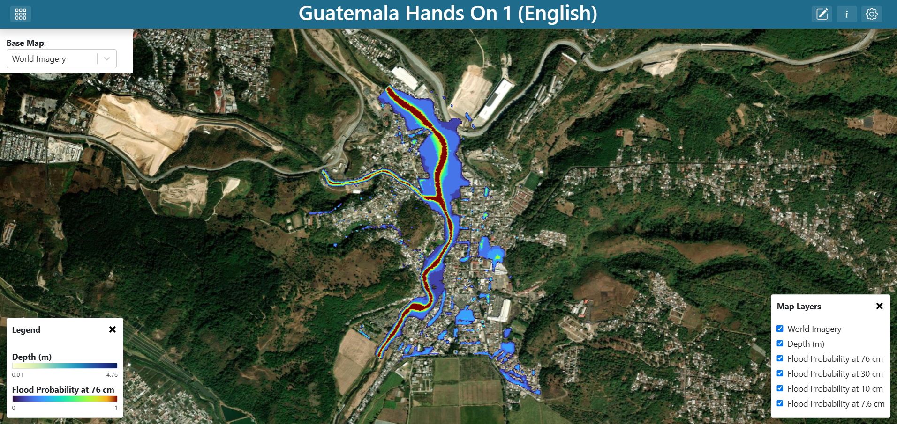

   **Screenshot:** the finished dashboard, layer control open so all five layers
   are visible.

This exercise is about raster layers: where the URL goes, how a colour ramp is
chosen, and the difference between letting the app scale a layer and pinning the
scale yourself.

Step 1 — Create the dashboard
-----------------------------

#. Create a new dashboard (see `Creating a dashboard`_) with:

   * **Name**: ``Guatemala Hands On 1 (English)``
   * **Description**: ``Solution for WMO Guatemala Hands On Exercise #1``

#. Enter edit mode, open **Dashboard Settings**, and turn on
   **Unrestricted Grid Item Movement**. Save the settings.

Step 2 — Add the map
--------------------

#. Click **Add Dashboard Item**, then **Edit** on the new item.
#. Set **Visualization Type** to **Map** (in the **Default** group).
#. Five arguments appear: **Base Map**, **Layer Control**, **Layers**,
   **Map Extent** and **Map Drawing**. Leave them for now — you will fill them
   over the next steps.
#. Tick **Layer Control**. This is what gives viewers the layer list, and with
   five layers it is not optional.

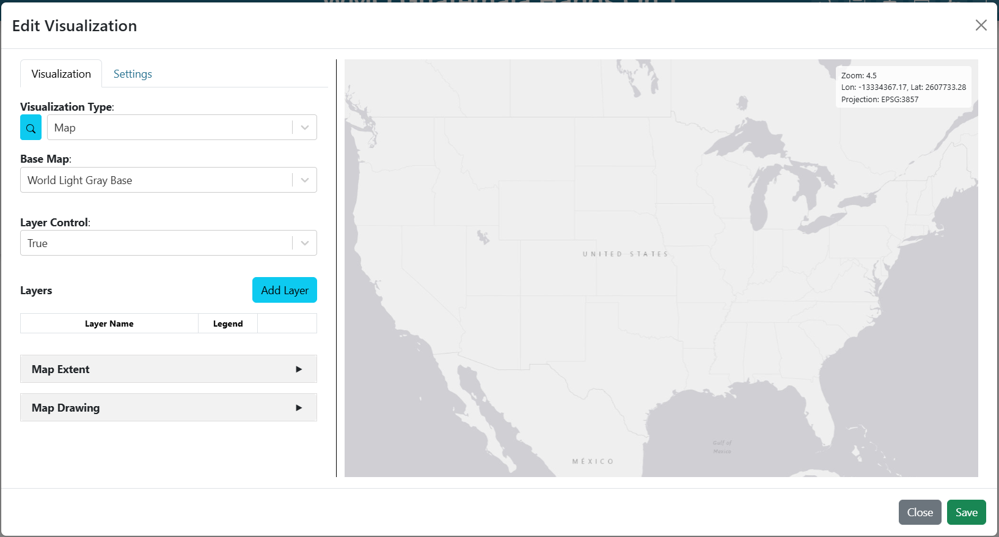

   **Screenshot:** the **Map** visualization's five arguments, with
   **Layer Control** ticked.

Step 3 — Add the depth layer
----------------------------

#. Next to **Layers**, click **Add Layer**. The layer editor opens with tabs
   **Layer**, **Source**, **Style**, **Legend**, **Attributes/Table Popup** and
   **Custom Modal Popup**.
#. On the **Layer** tab, set **Name** to ``Depth (m)``.
#. Still on the **Layer** tab, open **Layer Properties** and add:

   * ``opacity`` = ``.5``

   Layers draw in the order they appear in the list: the first one added sits
   lowest, directly above the base map, and each later one paints over it. Depth
   is added first, so it is the bottom data layer, and half opacity lets the
   base map's imagery read through it — you can see *which* streets and
   buildings the water is sitting on rather than just a coloured blob.
#. On the **Source** tab, set **Source Type** to **GeoTIFF** and fill in:

   .. list-table::
      :header-rows: 1
      :widths: 24 76

      * - Field
        - Value
      * - ``url``
        - ``https://cog-s3-test-401506828094-us-east-1-an.s3.us-east-1.amazonaws.com/PBI_Actividad_2/depth_m.tif``
      * - ``mask_below``
        - ``0.01``

   ``mask_below`` hides cells at or below the value given. Dry ground in this
   raster is 0, and without a mask the whole domain would be painted the
   ramp's low colour instead of showing the base map.
#. On the **Style** tab, leave the mode on **Continuous** and pick the
   **YlGnBu** ramp. Leave **Min** and **Max** empty.

   .. note::

      Leaving both bounds empty is a deliberate choice, not laziness. An empty
      bound means "resolve it from the file's statistics at render time", so the
      ramp stretches across whatever range this particular raster holds — 0 to
      about 4.76 m here. Set both and the raw values are styled directly
      instead.

#. On the **Legend** tab, leave the legend on **default**. For a ramp-styled
   raster the app generates a colour bar automatically.
#. Save the layer.

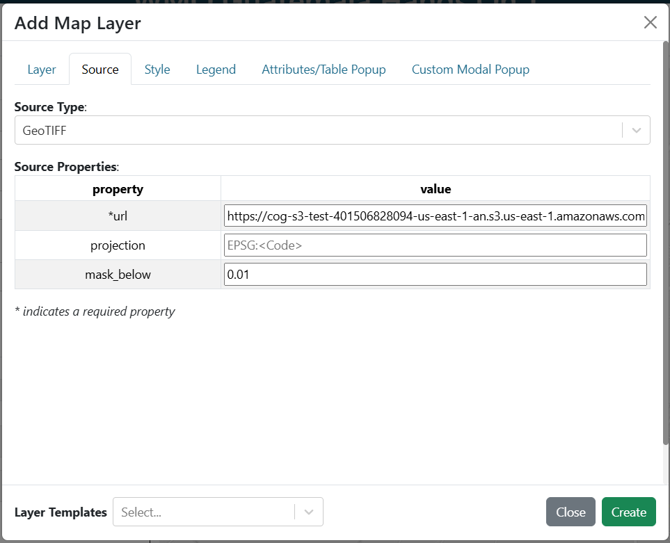

   **Screenshot:** the **Source** tab with **Source Type** GeoTIFF, the depth
   URL, and ``mask_below`` 0.01.

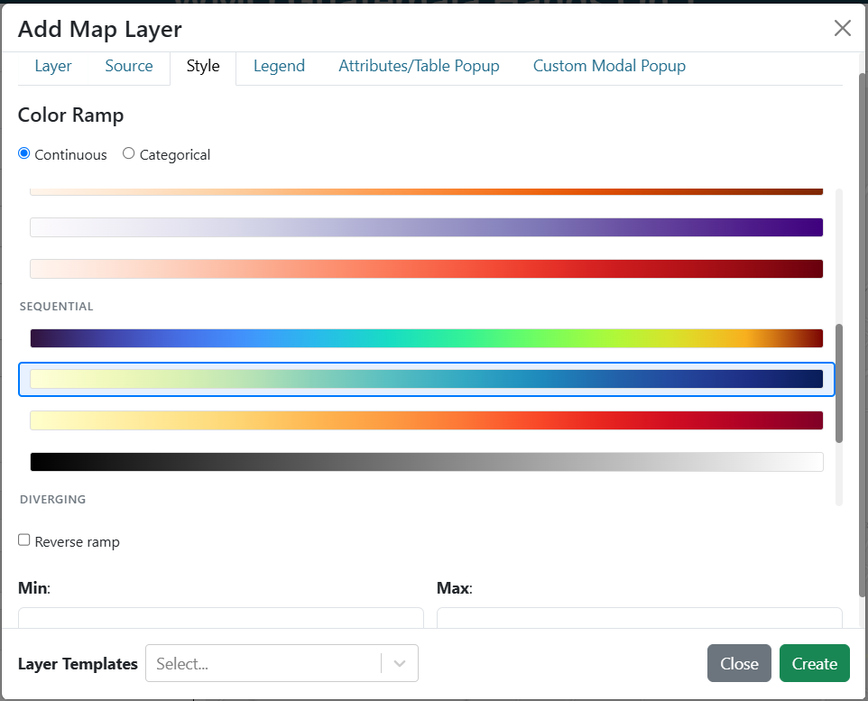

   **Screenshot:** the **Style** tab, **Continuous** mode, **YlGnBu** selected,
   **Min** and **Max** empty.

Step 4 — Add the four probability layers
----------------------------------------

These four are identical except for the URL and the name, so build one and
repeat. Add them in this order, so the deepest threshold ends up lowest in the
stack and the shallowest — which covers the largest area — ends up on top:

.. list-table::
   :header-rows: 1
   :widths: 34 66

   * - Layer **Name**
     - ``url``
   * - ``Flood Probability at 76 cm``
     - ``.../PBI_Actividad_2/prob_76cm.tif``
   * - ``Flood Probability at 30 cm``
     - ``.../PBI_Actividad_2/prob_30cm.tif``
   * - ``Flood Probability at 10 cm``
     - ``.../PBI_Actividad_2/prob_10cm.tif``
   * - ``Flood Probability at 7.6 cm``
     - ``.../PBI_Actividad_2/prob_7p62.tif``

(``...`` is the bucket root from `The data`_.)

For **each** of the four:

#. **Add Layer**, and set **Name** from the table.
#. **Source** tab: **Source Type** **GeoTIFF**, the ``url`` from the table, and
   ``mask_below`` = ``0``. Zero means "no chance of flooding here", which is
   information the base map already conveys better than a coloured patch.
#. **Style** tab: **Continuous**, ramp **turbo**, **Min** = ``0``,
   **Max** = ``1``.

   .. important::

      Pinning Min and Max to 0–1 is the whole point of these four layers.
      Probability has a fixed, meaningful range, and all four layers must use the
      same one or they cannot be compared. Left to auto-scale, each layer would
      stretch its ramp over its own range and 0.2 would look like a different
      severity on each — the shallow layer's mid-tone and the deep layer's
      mid-tone would mean different numbers.

#. **Legend** tab: leave as **default**.
#. Save the layer.

Only the first probability layer needs its legend enabled; the four share a
scale, so four identical colour bars would just take up room. In the shipped
solution the 76 cm layer carries the legend and the other three have none.

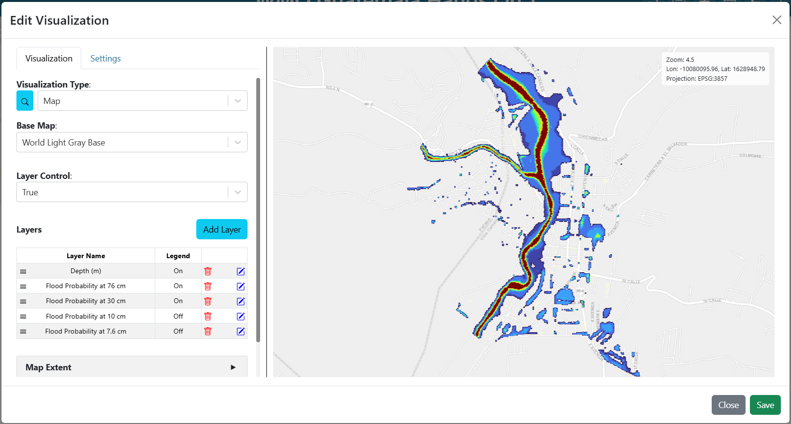

   **Screenshot:** the **Layers** list with all five layers in order.

Step 5 — Add the base map selector
----------------------------------

The base map is a variable input so the viewer can switch it without editing
anything. Build the input first, then point the map at it.

#. **Add Dashboard Item** → **Edit**.
#. **Visualization Type** → **Variable Input**.
#. Fill in:

   .. list-table::
      :header-rows: 1
      :widths: 32 68

      * - Argument
        - Value
      * - ``variable_name``
        - ``Base Map``
      * - ``show_label``
        - ticked
      * - ``variable_options_source``
        - ``Base Map Layers``
      * - ``initial_value``
        - ``https://server.arcgisonline.com/arcgis/rest/services/World_Imagery/MapServer``

   ``Base Map Layers`` is a built-in options source — it fills the dropdown with
   the base maps the instance offers, so you do not enumerate them yourself.
#. On the **Settings** tab set **Background Color** to ``#ffffff``. Without it
   the dropdown floats on the map with no backing and is hard to read.
#. Save, and drag the item to the top-left corner over the map.

.. figure:: images/ex1-variable-input-basemap.png
   :alt: The base map variable input configuration
   :width: 100%

   **Screenshot:** the **Variable Input** arguments for the base map selector.

Step 6 — Point the map at the variable
--------------------------------------

#. Open the map item's **Edit** again.
#. In the **Base Map** argument, choose ``Base Map`` from the **Variable Inputs**
   section at the bottom of the dropdown. The value becomes ``${Base Map}``.

.. note::

   Two ways to reference a variable, depending on the argument. Dropdown-type
   arguments list the available variables in a **Variable Inputs** section at the
   bottom — pick from there. Free-text arguments take the template syntax
   ``${Variable Name}`` typed by hand. The name inside the braces must match
   ``variable_name`` exactly, spaces and punctuation included.

Step 7 — Set the extent and fill the viewport
---------------------------------------------

#. Still editing the map, pan and zoom the preview until Guatemala City fills
   the frame.
#. In **Map Extent**, choose **Use the Previewed Map Extent** to freeze what you
   are looking at. To match the shipped solution exactly, instead choose
   **Use a Custom Extent** and enter:

   .. code-block:: text

      -10078437.52,1629645.07,15

   That is ``centre-x,centre-y,zoom`` in EPSG:3857 metres.
#. On the **Settings** tab, turn on **Fill Viewport** so the map occupies the
   whole window.
#. Save the item, then save the dashboard.

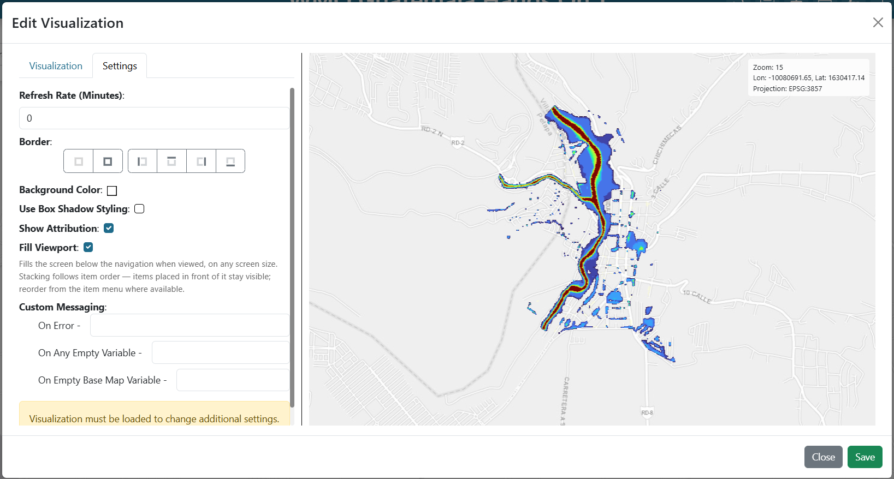

   **Screenshot:** the **Settings** tab with **Fill Viewport** on.

Checkpoint
----------

You should now have:

* A map filling the window, showing Guatemala City.
* A layer control listing five layers; toggling each changes what is drawn.
* A colour bar for depth, and one for probability.
* A base-map dropdown top-left that changes the imagery underneath.
* Depth visible through to the probability layers beneath it, thanks to the
  0.5 opacity.

Talking points
--------------

* **Auto-scaled versus pinned ramps.** Depth auto-scales because its range is a
  property of this particular event. Probability is pinned to 0–1 because the
  range is fixed by definition and the four layers must be comparable. This is
  the single most transferable idea in the exercise.
* **What** ``mask_below`` **is for.** Rasters usually encode "nothing here" as a
  real number, and unless you mask it the ramp will faithfully colour the whole
  domain. Different layers need different thresholds: ``0.01`` for depth,
  ``0`` for probability.
* **Layer order is draw order.** The first layer in the list draws lowest, just
  above the base map, and each later one paints over it. Depth goes in first and
  so sits at the bottom; the four probability layers stack above it, deepest
  threshold lowest. Nothing is hidden in practice because every layer is masked
  where it has no data — the probabilities paint only where there is a non-zero
  chance, and depth only where there is water.
* **The projection constraint.** All five rasters are EPSG:3857 copies. See the
  warning in `The data`_ — this comes up again in exercise 3, where getting it
  wrong makes layers appear and then vanish.

Exercise 2 — Impact for a single storm
======================================

What you are building
---------------------

A map on the left showing one storm's flood depth and the buildings and roads it
floods, and on the right a table and a card summarising that storm. A dropdown
selects the storm, and everything re-computes.

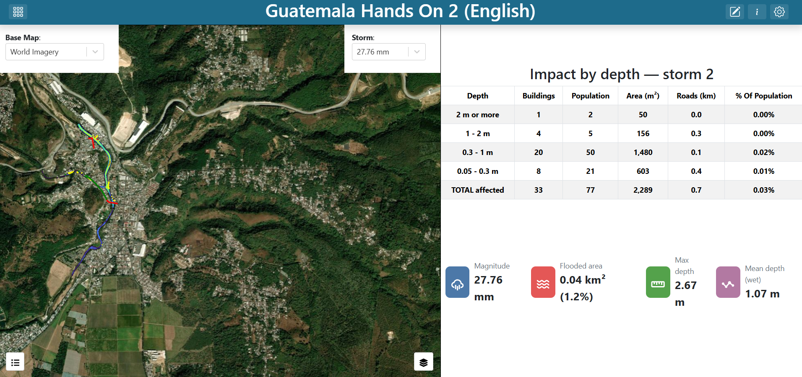

   **Screenshot:** the finished dashboard, with the storm dropdown, map, summary
   table and card.

New ideas here: reading a slice out of a Zarr store, a vector layer whose
features are produced by a plugin rather than fetched from a URL, and one
variable input driving four separate things at once.

Step 1 — Create the dashboard
-----------------------------

Create it as before:

* **Name**: ``Guatemala Hands On 2 (English)``
* **Description**: ``Solution for WMO Guatemala Hands On Exercise #2``

Turn on **Unrestricted Grid Item Movement** in **Dashboard Settings**.

Step 2 — Add the storm selector first
-------------------------------------

Build this before anything else. Four other items reference it, and they cannot
be wired up until the variable exists.

#. **Add Dashboard Item** → **Edit** → **Visualization Type**
   **Variable Input**.
#. Fill in:

   .. list-table::
      :header-rows: 1
      :widths: 32 68

      * - Argument
        - Value
      * - ``variable_name``
        - ``Storm``
      * - ``show_label``
        - ticked
      * - ``variable_options_source``
        - ``Flood Maps (English): Storm Impact Summary (English) - Index``
      * - ``initial_value``
        - ``2``

   .. note::

      That options source is not something you type. It is generated from an
      existing plugin argument, in the form
      ``<group>: <plugin label> - <Argument>``. Picking it means "offer the same
      choices the Storm Impact Summary plugin's ``index`` argument offers", so
      the dropdown is populated from the plugin and cannot drift out of sync with
      it. The plugin supplies 198 entries, each labelled with the storm's
      magnitude in millimetres rather than its index, because a magnitude is
      something a forecaster can reason about and an index is not.

#. On the **Settings** tab set **Background Color** ``#ffffff``, and a border on
   the right side only.
#. Save and place it along the top of where the map will go.

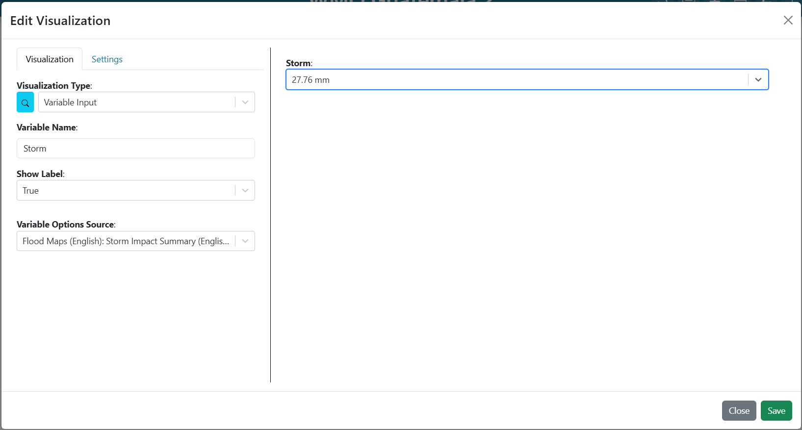

   **Screenshot:** the **Variable Input** arguments for the storm selector, with
   the plugin-derived options source selected.

Also add a **Base Map** variable input, exactly as in
`Step 5 — Add the base map selector`_.

Step 3 — Add the map with the Zarr depth layer
----------------------------------------------

#. **Add Dashboard Item** → **Edit** → **Visualization Type** **Map**.
#. Tick **Layer Control**. Set **Base Map** to ``${Base Map}``.
#. **Add Layer**:

   * **Layer** tab: **Name** = ``Flood Depth``
   * **Source** tab: **Source Type** = **Zarr**, then:

     .. list-table::
        :header-rows: 1
        :widths: 24 76

        * - Field
          - Value
        * - ``url``
          - ``https://cog-s3-test-401506828094-us-east-1-an.s3.us-east-1.amazonaws.com/floodmaps_test``
        * - ``variable``
          - ``depth``
        * - ``index``
          - ``${Storm}``

   * **Style** tab: **Continuous**, ramp **turbo**, **Min** and **Max** empty.
   * **Legend** tab: **default**.

#. Save the layer.

.. important::

   The ``index`` field is where this exercise becomes interactive. The Zarr store
   holds all 198 storms in one array, and ``index`` selects the slice. Binding it
   to ``${Storm}`` means changing the dropdown re-reads a different slice — no
   duplicated layers, no separate files.

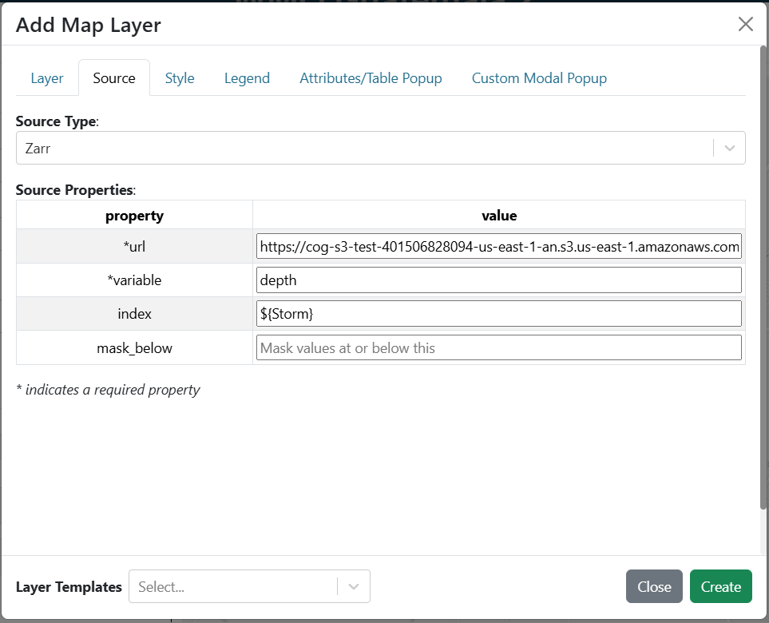

   **Screenshot:** the **Source** tab with **Source Type** Zarr, the store URL,
   ``variable`` depth and ``index`` ``${Storm}``.

Step 4 — Add the plugin-backed impact layer
-------------------------------------------

This layer's features are computed per request by a plugin. There is no GeoJSON
URL — the plugin samples depth onto every building and road and returns the
result.

#. **Add Layer** on the same map.
#. Go straight to the **Source** tab and set **Source Type** to
   **Storm Impact Layer (English)**. Dynamic map-layer plugins appear in the same
   **Source Type** dropdown as GeoTIFF and Zarr, listed under their plugin group.
#. The plugin's arguments appear. Set ``index`` to ``${Storm}``.
#. Click **Fetch plugin defaults**.

   .. note::

      This is the step that saves the most work. The plugin's ``run()`` returns a
      ready-made scaffold — the layer name, the source binding, a rule-based
      style keyed on the ``banda`` (depth band) attribute, and a matching legend.
      After fetching you should see the layer named
      **Flooded buildings and roads**, eight style rules, and a four-item
      **Depth** legend, none of which you had to author. Authoring vector style
      rules by hand is error-prone: a rule in the wrong shape silently never
      matches and leaves every feature grey.

#. Check the **Style** and **Legend** tabs to see what arrived. Colours run green
   → yellow → red → purple across four depth bands, with separate rules for
   polygons (buildings) and linestrings (roads) so roads get a stroke wide enough
   to see.
#. Save the layer.

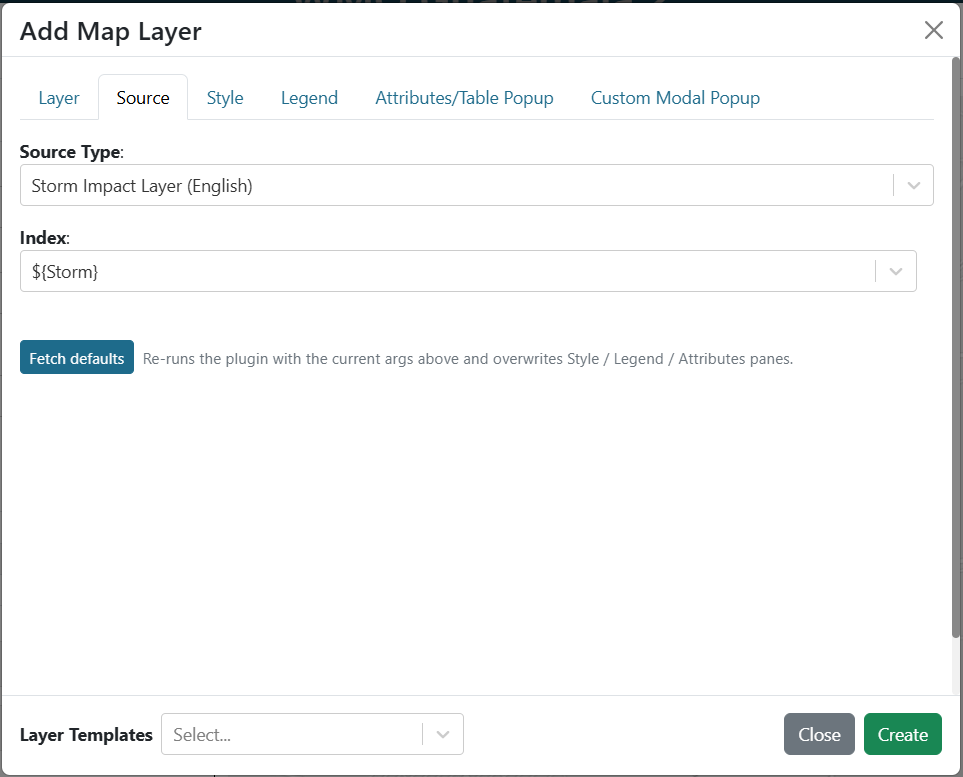

   **Screenshot:** the **Source** tab with **Storm Impact Layer (English)**
   selected, ``index`` bound to ``${Storm}``, and the **Fetch plugin defaults**
   button.

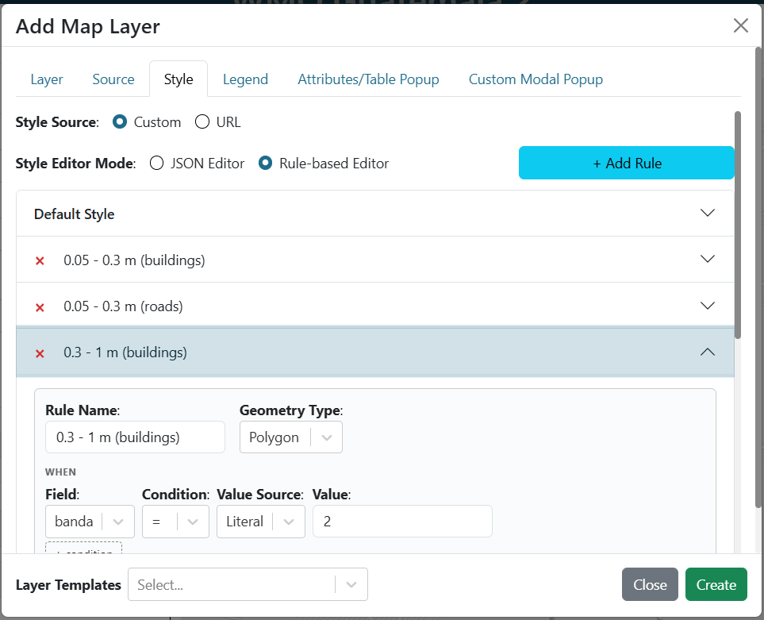

   **Screenshot:** the **Style** tab after fetching, showing the eight rules on
   the ``banda`` attribute.

Then finish the map:

#. **Map Extent**: **Use a Custom Extent**, ``-10078413.13,1629754.90,14.83``.
#. **Settings** tab: **Background Color** ``#ffffff`` and a border on all four
   sides. This map does *not* fill the viewport — it shares the window with the
   table and card.
#. Save.

Step 5 — Add the summary table
------------------------------

#. **Add Dashboard Item** → **Edit**.
#. **Visualization Type** → **Storm Impact Summary (English)**.
#. Set ``index`` to ``${Storm}``.
#. Save and place it to the right of the map.

The table breaks the storm's flooded features into depth bands, deepest first,
with counts of buildings, population, area, road length and the share of the
municipality's population affected.

Step 6 — Add the storm card
---------------------------

#. **Add Dashboard Item** → **Edit**.
#. **Visualization Type** → **Storm Summary (English)**.
#. Set ``index`` to ``${Storm}``.
#. Save and place it below the table.

The card gives the headline figures — the storm, its magnitude, the flooded area
and the population affected — for someone who will not read a table.

Step 7 — Save and test the wiring
---------------------------------

Save the dashboard, leave edit mode, and change the storm dropdown. All four
items should update: the Zarr layer re-reads its slice, the impact layer
re-runs, and the table and card re-fetch.

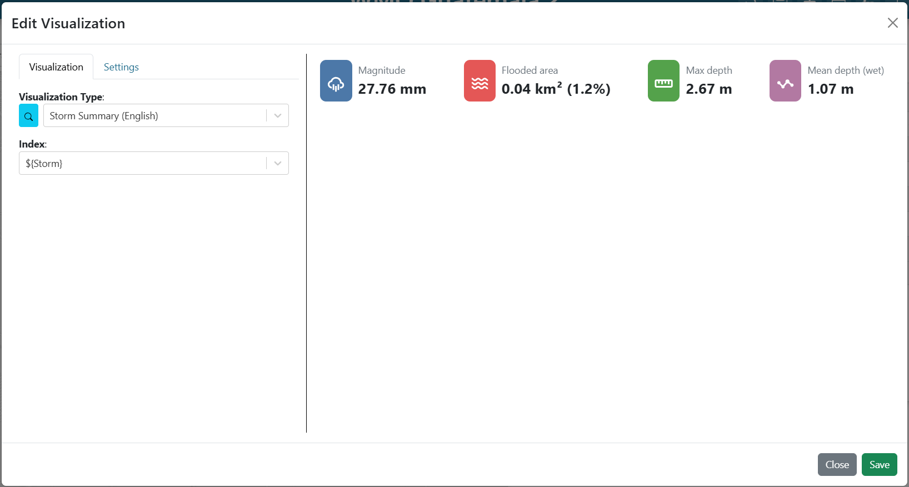

   **Screenshot:** the summary table and card for one storm.

Checkpoint
----------

* A storm dropdown labelled with magnitudes in millimetres, not indices.
* Changing it updates the depth raster, the coloured buildings and roads, the
  table and the card — all four.
* The layer control lists **Flood Depth** and **Flooded buildings and roads**.
* The impact layer is coloured by depth band with a **Depth** legend, and roads
  are visible as coloured lines rather than hairlines.

Talking points
--------------

* **One variable, four consumers.** ``${Storm}`` appears in a Zarr source index,
  a plugin layer argument, and two visualization arguments. Nothing in the four
  items knows about the others; they all just declare a dependency on a name.
* **Dynamic layers re-run; static layers re-fetch.** The Zarr layer re-reads a
  slice of an existing array. The impact layer re-executes Python that samples a
  raster onto 5,000-odd geometries. Same trigger, very different cost — which is
  why the plugin reports progress while it works.
* **Labels versus values.** The dropdown shows magnitude, the plugin receives an
  index. Presenting a meaningful label over an opaque key is nearly always worth
  the indirection.
* **The magnitudes are placeholders.** They are illustrative, not measured. They
  are unique and monotonic, so they identify a storm reliably and sort sensibly,
  but do not present them as physical rainfall totals.
* **Why the plugin ships a style.** The alternative — hand-authoring eight rules
  in the GUI — fails silently when a rule is malformed. Shipping the style from
  ``run()`` means the layer is correct the first time and stays correct if the
  bands change.

Exercise 3 — Hazard classification with adjustable thresholds
=============================================================

What you are building
---------------------

A full-window map carrying the five rasters from exercise 1 plus two computed
layers: a hazard classification and the buildings and roads that fall inside it.
Four number inputs across the top set the probability threshold for each hazard
level, and an impact table sits under them. Change a threshold and the
classification, the affected features and the table all recompute.

.. figure:: images/ex3-finished.png
   :alt: The finished exercise 3 dashboard
   :width: 100%

   **Screenshot:** the finished dashboard — full-window map, four threshold
   inputs along the top, impact table on the right.

This is the most interactive of the three, and the one where what the interface
*implies* deserves the most scrutiny.

Understanding the four thresholds
---------------------------------

Each hazard level is tied to **one** depth threshold and has its **own**
probability gate:

.. list-table::
   :header-rows: 1
   :widths: 18 32 25 25

   * - Level
     - Driven by
     - Colour
     - Notebook default gate
   * - Low
     - P(≥ 7.6 cm)
     - green
     - 0.3
   * - Medium
     - P(≥ 10 cm)
     - yellow
     - 0.2
   * - High
     - P(≥ 30 cm)
     - red
     - 0.1
   * - Severe
     - P(≥ 76 cm)
     - purple
     - 0.15

A cell takes the level of the **deepest** threshold whose gate it clears.

.. warning::

   Two things to know before you present this, both covered at length in
   ``notebooks/03_hazard_classification.ipynb``:

   **The 76 cm raster contains only the values 0 and 0.2.** At most 2 of 10
   ensemble members ever reached that depth anywhere in the domain. So any
   Severe gate above 0.2 makes the Severe class *unreachable* — the colour simply
   never appears, and a viewer moving that slider gets no feedback distinguishing
   "nothing qualifies" from "the control is broken".

   **Three of the four depth labels are wrong upstream.** The files say
   7.62 / 10 / 30 / 76 cm; three are actually 15.24 / 30.48 / 60.96 cm (6, 12
   and 24 inches). The ordering is right, so the classification is unaffected,
   but do not quote the centimetre figures as verified.

Step 1 — Create the dashboard and the base map input
----------------------------------------------------

* **Name**: ``Guatemala Hands On 3 (English)``
* **Description**: ``Solution for WMO Guatemala Hands On Exercise #3``

Turn on **Unrestricted Grid Item Movement**, then add a **Base Map** variable
input as in `Step 5 — Add the base map selector`_. Give it a border on all four
sides and a white background.

Step 2 — Add the four threshold inputs
--------------------------------------

Build all four before the layers that consume them. Each is a **Variable Input**
with ``variable_options_source`` set to ``number``:

.. list-table::
   :header-rows: 1
   :widths: 44 14 14 14 14

   * - ``variable_name``
     - min
     - max
     - step
     - ``initial_value``
   * - ``Low Threshold (P(≥7.6 cm))``
     - 0
     - 1
     - 0.05
     - 0.8
   * - ``Medium Threshold (P(≥10 cm))``
     - 0
     - 1
     - 0.05
     - 0.8
   * - ``High Threshold (P(≥30 cm))``
     - 0
     - 1
     - 0.05
     - 0.8
   * - ``Severe Threshold (P(≥76 cm))``
     - 0
     - 1
     - 0.05
     - 0.8

For each one:

#. **Add Dashboard Item** → **Edit** → **Visualization Type**
   **Variable Input**.
#. Set ``variable_name`` from the table. Tick ``show_label``.
#. Set ``variable_options_source`` to ``number``, then fill the metadata:
   **Minimum** ``0``, **Maximum** ``1``, **Step** ``0.05``.
#. Set ``initial_value`` to ``0.8``.
#. **Settings** tab: **Background Color** ``#ffffff``, and a top border. Give the
   leftmost input a left border and the rightmost a right border, so the four
   read as one strip.
#. Save, and place them side by side across the top of the map area.

.. note::

   The variable names carry their meaning — ``Low Threshold (P(≥7.6 cm))`` rather
   than ``umbral_bajo``. The name is what the viewer reads above the input, so it
   has to say which probability is being gated. It is also the key other items
   reference, so choose it before wiring anything and avoid renaming later.

.. figure:: images/ex3-threshold-inputs.png
   :alt: The four threshold variable inputs across the top of the dashboard
   :width: 100%

   **Screenshot:** the four threshold inputs side by side, each showing its
   label and value.

Step 3 — Add the map and the five rasters
-----------------------------------------

Add a **Map** item and build the same five raster layers as
`Exercise 1 — A flood depth and probability map`_ — same names, URLs, ramps and
bounds. Set **Base Map** to ``${Base Map}`` and tick **Layer Control**.

The quickest route, if you still have exercise 1: open its map item's three-dot
menu, choose **Export**, then use **Import Dashboard Item** here and edit the
imported copy. That carries all five layers over intact.

Step 4 — Add the hazard classification layer
--------------------------------------------

#. **Add Layer** on the map.
#. **Source** tab: **Source Type** → **Flood Hazard Layer (English)**.
#. Four arguments appear. Bind each to its variable:

   .. list-table::
      :header-rows: 1
      :widths: 26 74

      * - Argument
        - Value
      * - ``umbral_bajo``
        - ``${Low Threshold (P(≥7.6 cm))}``
      * - ``umbral_medio``
        - ``${Medium Threshold (P(≥10 cm))}``
      * - ``umbral_alto``
        - ``${High Threshold (P(≥30 cm))}``
      * - ``umbral_severo``
        - ``${Severe Threshold (P(≥76 cm))}``

#. Click **Fetch plugin defaults**. The layer is named
   **Hazard classification**, styled with four rules on the ``peligro``
   attribute, and given a four-item **Hazard** legend.
#. Save the layer.

.. note::

   The argument names are Spanish (``umbral_bajo`` = "low threshold") because the
   plugins were ported from the original UFFIS notebook and the internal names
   were kept so the two can be read side by side. Only the labels were
   translated. This is worth mentioning if attendees notice the mismatch.

.. figure:: images/ex3-hazard-layer-source.png
   :alt: The hazard layer source configuration with four bound thresholds
   :width: 100%

   **Screenshot:** the **Source** tab for the hazard layer, four arguments bound
   to the four threshold variables.

Step 5 — Add the affected-features layer
----------------------------------------

#. **Add Layer** again.
#. **Source** tab: **Source Type** → **Flood Impact Layer (English)**.
#. Bind the same four arguments to the same four variables as in step 4.
#. **Fetch plugin defaults** → the layer arrives as
   **Buildings and roads at risk** with eight rules (polygon and linestring per
   level) and a **Hazard** legend.
#. Save the layer.

The two layers answer different questions from the same thresholds: the hazard
layer classifies *ground*, this one classifies *assets*. Keeping them separate
lets a viewer turn off the ground shading and look only at what is affected.

Step 6 — Finish the map
-----------------------

#. **Map Extent**: **Use a Custom Extent**, ``-10077781.20,1629865.34,15.13``.
#. **Settings** tab: turn on **Fill Viewport**.
#. Save.

.. important::

   The rasters must be the ``PBI_Actividad_2`` EPSG:3857 copies. If any layer
   points at a ``Guatemala_IBF`` UTM original, the map will auto-fit to that
   raster's projection, jump somewhere far from Guatemala, and the vector layers
   will appear to load and then vanish. This exact bug cost real debugging time
   on this dashboard.

Step 7 — Add the impact summary table
-------------------------------------

#. **Add Dashboard Item** → **Edit**.
#. **Visualization Type** → **Flood Impact Summary (English)**.
#. Bind the same four arguments to the same four variables.
#. **Settings** tab: white background, borders on the left, right and bottom so
   it joins the strip of threshold inputs above it.
#. Save and place it directly below the threshold inputs on the right.

Step 8 — Save and test
----------------------

Save, leave edit mode, and move a threshold. The hazard shading, the affected
features and the table should all recompute together.

.. figure:: images/ex3-thresholds-in-action.png
   :alt: The dashboard before and after lowering a threshold
   :width: 100%

   **Screenshot:** the same view before and after lowering the High threshold,
   showing the classification expand.

Checkpoint
----------

* A full-window map with seven layers in the layer control.
* Four labelled threshold inputs across the top, each stepping by 0.05.
* Moving any threshold updates the hazard layer, the impact layer and the table.
* Raising the Severe threshold above 0.2 makes purple disappear entirely — and
  it should, for the reason in the warning above.
* Progress messages appear while the layers recompute.

Talking points
--------------

* **Four gates on four different questions.** "Severe" means P(≥76 cm) ≥ 0.15
  while "High" means P(≥30 cm) ≥ 0.1. Those are different questions with
  different cutoffs, so the level names are not comparable to each other and
  "severe" carries no meaning on its own. Setting all four gates equal is a good
  demonstration: the levels then differ only by depth, which is far easier to
  explain.
* **An unreachable class is an interface problem.** The Severe gate can be set
  where nothing can qualify, and the interface gives no hint. Ask attendees how
  they would fix it — cap the input at 0.2? show the value range? annotate the
  legend? There is no single right answer, and the discussion is the point.
* **Vectorising a classification.** A map layer can only point at a URL, and
  nothing here serves a computed raster, so the plugin vectorises the classified
  grid into roughly 600 polygons. Adjacent cells of equal class merge, so this is
  exact rather than an approximation. Normal and NoData are dropped — about 90%
  of the grid — because a basemap shows unaffected ground better than a coloured
  layer does.
* **Where the probabilities came from.** These arrived already populated in the
  partners' geopackage with no note on method. Notebook 3 recovers it by testing
  four candidate samplings and lands on ``all_touched`` zonal maximum at about
  98% agreement, with the residual pointing at a real open question about the
  data. Worth raising as a lesson in verifying rather than assuming.

Appendix A — Item positions
===========================

The grid is 100 columns wide. Positions are ``x``, ``y`` (top-left) and ``w``,
``h`` (size in grid units). Match approximately; these are for reference, not
transcription.

Exercise 1
----------

.. list-table::
   :header-rows: 1
   :widths: 46 14 14 13 13

   * - Item
     - x
     - y
     - w
     - h
   * - Map (**Fill Viewport**)
     - 0
     - 0
     - 99
     - 41
   * - Variable Input — Base Map
     - 0
     - 0
     - 15
     - 5

Exercise 2
----------

.. list-table::
   :header-rows: 1
   :widths: 46 14 14 13 13

   * - Item
     - x
     - y
     - w
     - h
   * - Map
     - 0
     - 0
     - 55
     - 38
   * - Variable Input — Base Map
     - 0
     - 0
     - 15
     - 6
   * - Variable Input — Storm
     - 43
     - 0
     - 12
     - 6
   * - Storm Impact Summary (table)
     - 55
     - 2
     - 45
     - 26
   * - Storm Summary (card)
     - 55
     - 25
     - 45
     - 12

Exercise 3
----------

.. list-table::
   :header-rows: 1
   :widths: 46 14 14 13 13

   * - Item
     - x
     - y
     - w
     - h
   * - Map (**Fill Viewport**)
     - 0
     - 0
     - 99
     - 41
   * - Variable Input — Base Map
     - 0
     - 0
     - 17
     - 6
   * - Variable Input — Low Threshold
     - 56
     - 0
     - 11
     - 7
   * - Variable Input — Medium Threshold
     - 66
     - 0
     - 13
     - 7
   * - Variable Input — High Threshold
     - 78
     - 0
     - 11
     - 7
   * - Variable Input — Severe Threshold
     - 88
     - 0
     - 12
     - 7
   * - Flood Impact Summary (table)
     - 56
     - 7
     - 44
     - 21

Appendix B — Importing a finished solution
==========================================

To reset between sessions, or to check your work, the finished dashboards are in
this repository under ``dashboards/``:

.. code-block:: text

   dashboards/Guatemala_Hands_On_1_English.json
   dashboards/Guatemala_Hands_On_2_English.json
   dashboards/Guatemala_Hands_On_3_English.json

Spanish versions sit alongside them with ``_Espanol`` in place of ``_English``.
The Spanish dashboards use the ``_es`` plugins throughout, so a dashboard is
internally consistent in one language — do not mix them.

These files are whole-dashboard exports. Individual items can also be moved
between dashboards through **Export** on an item's three-dot menu and
**Import Dashboard Item** in the header, which is the quickest way to reuse
exercise 1's five raster layers in exercise 3.

Appendix C — Troubleshooting
============================

.. list-table::
   :header-rows: 1
   :widths: 40 60

   * - Symptom
     - Cause and fix
   * - The **Flood Maps (English)** group is missing from
       **Visualization Type**.
     - ``tgf_wmo_plugins`` is not installed in the environment the app runs in,
       or the app was not restarted. Install it server-side and restart.
   * - A visualization says a variable is empty.
     - The ``${...}`` name does not match a ``variable_name`` exactly, or the
       variable input was added after the item that references it. Check
       spelling, spaces and punctuation, then re-select the variable.
   * - A layer flashes on and then disappears.
     - Almost always a projection problem. Confirm the layer points at the
       ``PBI_Actividad_2`` EPSG:3857 copy, not a ``Guatemala_IBF`` UTM original.
   * - The whole map jumps to somewhere in Africa.
     - Same cause. A GeoTIFF in an unresolvable projection makes the auto-fit
       adopt coordinates that land near 0°, 0°.
   * - Every vector feature is grey.
     - The style rules are not matching. Use **Fetch plugin defaults** rather
       than hand-authoring rules; a malformed rule never matches and fails
       silently.
   * - A raster is a single flat colour.
     - The ramp bounds do not suit the data, or ``mask_below`` is unset so dry
       ground is being coloured. Check both.
   * - Purple never appears in exercise 3.
     - Expected if the Severe threshold is above 0.2. The 76 cm raster only ever
       holds 0 or 0.2. Lower the threshold to 0.2 or below.
   * - The dashboard cannot be edited.
     - Only the owner can edit, and only in edit mode. Check the header for the
       **Edit Dashboard** button.

Appendix D — Notes on the shipped JSON
======================================

Two small discrepancies you may notice when comparing this guide against the
exported solutions. Neither affects behaviour; both are recorded so they do not
read as mistakes in your own work.

* **The 30 cm probability layer has** ``rampMin`` **of** ``"00"`` **rather than**
  ``"0"``. A typing artifact from the GUI. It parses to zero identically.
* **The exercise 3 threshold inputs store two different defaults.** The active
  value, ``initial_value``, is ``0.8`` on all four. The options metadata also
  carries an ``initialValue`` of 0.3 / 0.2 / 0.1 / 0.15 — the notebook defaults —
  left over from an earlier revision. The dashboard loads at 0.8. If you want the
  notebook's classification on first load, set ``initial_value`` to the values in
  `Understanding the four thresholds`_ instead.
